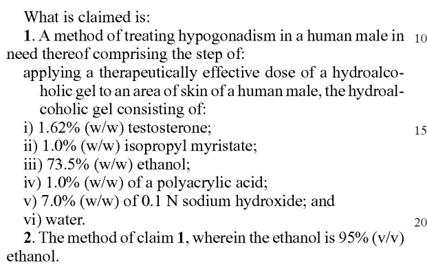
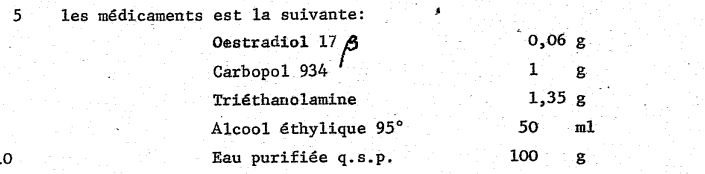

# 睾酮凝胶自制方法

本文根据匿名好心网友提供的资料整理而成。

**自制的睾酮凝胶不得用于医疗用途、不得销售，仅供个人学习、研发使用。**

**自制凝胶具有很大的风险性、不稳定性、麻烦性、买到假药的可能性。**

一切配方应以专利文书为准，**本文仅供参考，不排除有计算错误和操作错误**。专利文书可以用英文搜索引擎搜索 ANDROGEL patent（睾酮，专利编号US8466138B2）。

此文章仅供技术交流，目的在于讨论在家庭实验室工艺下复制药物制剂的可行性。作者不对文章正确性负责。本实验只适用于具有相关实验经验和专业技能的人士操作。实验者必须自行承担所有实验操作可能带来的风险和后果，并对实验过程中可能产生的事故和损失负责。作者对因不当操作导致的任何损失和事故不承担任何责任。
## 安全警示

 实验中使用的化学品可能具有一定的危险性，请在操作前仔细阅读化学品的安全说明书，并正确佩戴个人防护装备，如手套、防护眼镜和防护服等。在实验过程中，请注意防止化学品溅入皮肤或进入口腔和呼吸道，并保持通风良好的实验环境。

## 药品清单

- `睾酮激素`
- `卡波姆980/卡波姆934` 155元/10g 带P的，比如卡波姆934P是医药级，不好买，个人觉得也无必要性，980更耐乙醇一些
- `三乙醇胺` (嫌调pH麻烦的可以用氢氧化钠)
- `无水乙醇` (95%也可)
- `肉豆蔻酸异丙酯 （IPM)`：助渗，滋润皮肤
-  `丙二醇`：保湿，助渗 
其他助渗剂表面活性剂如要折腾可查阅论文自选，不值得费这劲，此处列出的助渗剂已经是最性价比最优方案。

## 配方

**以100克凝胶为例**：
- 睾酮1.62克
- IPM 1克
- 无水乙醇 70克
- 丙二醇 0.75克 （可选）
- 三乙醇胺 0.5克
- 卡波姆980 0.5克
- 纯净水 剩余部分

## 设备清单

- 精密天平（可用宝石秤代替，淘宝百元级通电子秤（量程2kg)
- 烧杯
- 量筒
- 搅拌棒
- 小注射器（2-5ml，抽取少量药品）
- 吸嘴袋（在这里面完成最终配制并挤进真空瓶）
- 真空乳液瓶（拼多多大路货的真空瓶挤一下约0.22g凝胶，但是建议买PP材质的真空瓶，pdd的透明真空瓶容易裂）
- 硅胶管（连接吸嘴袋挤凝胶进真空瓶）
- 真空室（可选）
## 配制步骤

### 1. 预制含药乙醇溶液
用天平称取睾酮9.25克、IPM 5.71克和丙二醇4.28克倒入整瓶500毫升无水乙醇，通过漏斗放入吸嘴袋，封好摇匀备用。加入前最好有空瓶对比确认乙醇实际含量是否为400克，不是的话需调到400克再加，因为有的无水乙醇写着500毫升实际上并不足量。
### 2. 卡波姆的处理
先准备好要用的纯净水，可以用瓶装饮用纯净水，水量比最终成品的水含量要少一些（后面加三乙醇胺要用水溶解一下），将卡波姆980称好后撒入水中，（每100克成品使用0.5克卡波姆，卡波姆太浓稠不利于挤出和搅拌）。尽量让卡波姆在水面上不堆叠起来，放着不动让它吸水，卡波姆多的话可以分次加入，直到白色全部消失。此时可以搅拌一下，然后继续静置两三天，中途可以震荡或搅拌一下。一定要耐心等它全部溶解成均匀粘稠溶液，里面不能有小块，太粘稠气泡排不出可以加热到60℃静置，也能加速溶解（也可冷水溶胀1天后水浴60℃加热半天即可）。
溶解后先倒入吸嘴袋，吸嘴袋水浴加热60℃用力震荡揉搓等使卡波姆充分分散，排出袋内空气后抽真空，使溶液内气泡尽量溶出，重复一次后静置在真空室中过夜即可。排气泡需保持溶液60℃，无真空室则跳过排除溶解气体的步骤。
### 3. 加入剩余材料
再加入含药的乙醇，睾酮凝胶每100克成品使用70克/87.5毫升无水乙醇，拧上吸嘴袋手挤混合均匀，此时溶液会析出一些空气，排出空气，混合均匀后用针管将三乙醇胺（三乙醇胺重量与使用的卡波姆重量相当，即如果配置100克成品用了0.5克卡波姆就加0.5克三乙醇胺）注入袋子（三乙醇胺加水稀释后加入），通过普通电子秤定至指定重量排出空气后拧上袋子用手挤压混匀，最后接上管子把袋子里的凝胶挤到真空瓶里（别挤太急，袋子会炸）。
### 4.转移溶液，成凝胶态

LogP: 睾酮3.3，乙酸睾酮4.45，丙酸睾酮4.47（根据这 LogP 的差别来看如睾酮不好买到或许可用丙酸睾酮代替）
转移溶液适量至乳液瓶，按比调 LogP，至溶液成无色透明凝胶态。建议使用pH试纸确保凝胶不会腐蚀皮肤。
转移完成后静置一段时间后即可使用。

## 注意事项

1. 卡波姆粉末十分容易老化变质，建议在制作前，先只用卡波姆+70克乙醇制作凝胶，测试卡波姆是否变质，不然直接做会浪费睾酮。
2. 卡波姆吸入会中毒，建议洗澡前带上防毒面具光着身子在浴室取卡波姆，取完后加水膨胀，顺便清洗身体和周围环境，防止污染
3. 在一些平台可以尝试搜索睾酮的CAS 号`CAS 50-28-2`。睾酮原料可以选择在淘宝搜试剂代购，或者还可以选择其他网站上购买试剂。购买后在闲鱼上搜红外光谱检测，检测是否是真货，如果是假的可以退款。
4. 称睾酮、丙二醇和IPM时使用精密天平或者宝石秤。
5. 称乙醇和水时使用普通的电子秤
6. 其他液体添加进吸嘴袋时，使用注射器量取，注射。
7. 可以使用真空室消除气泡。
8. 用药是否合适：早上不涂抹睾酮，去医院测自身睾酮水平最低值，符合男性水平即可，用不涂睾酮的那只胳膊去抽血
9. 提高吸收率的妙妙小技巧：涂皮肤薄的地方，保湿可以提高一些吸收率。可以涂在大腿上待乙醇稍微挥发后交叠双腿让涂药区域重叠保湿。
10. 另外其实不需要在乎吸收率，原料这么便宜，大不了多涂点。
11. [https://www.reddit.com/r/estrogel/](https://www.reddit.com/r/estrogel/) 这个链接还有很多配方。

## 论文依据

